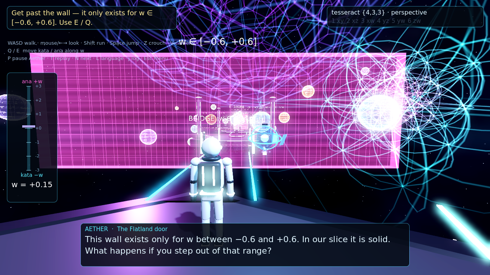
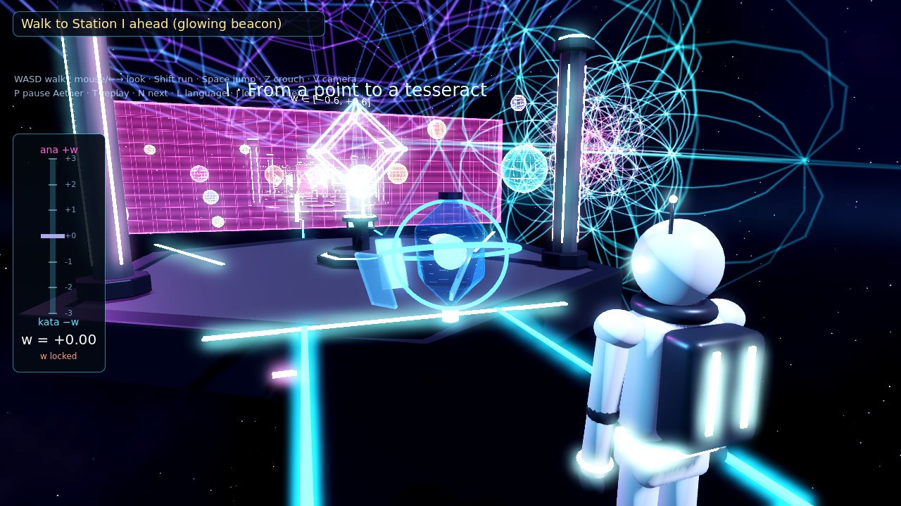
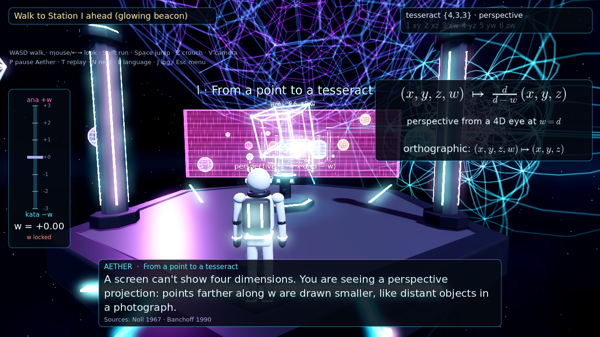
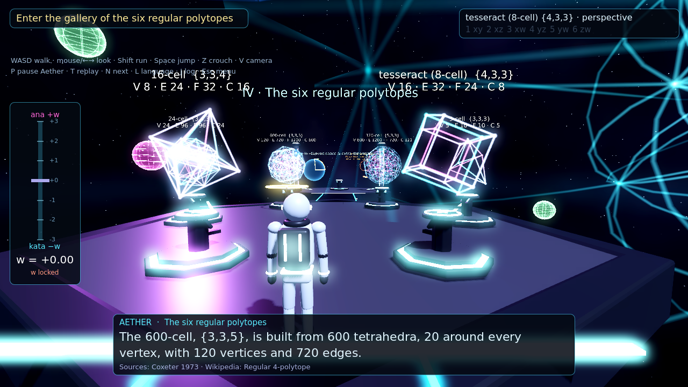
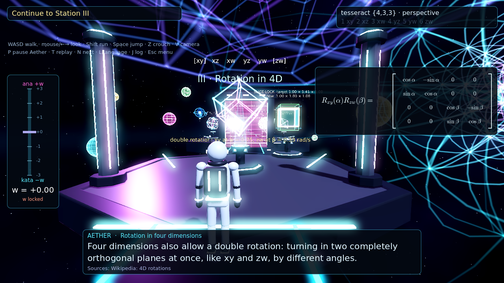
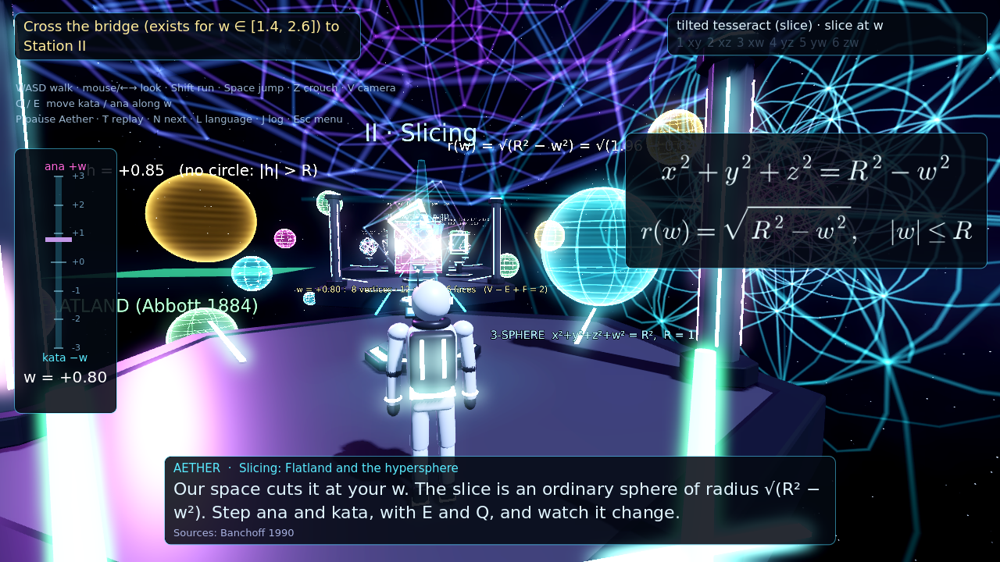
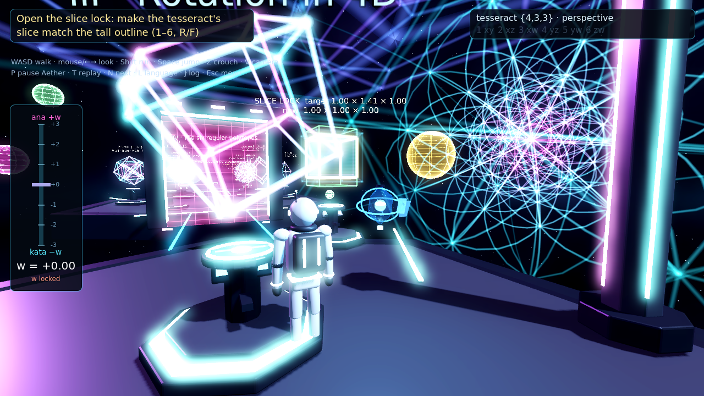

# Hyperspace Walk

**Play in the browser: https://loriens22.github.io/hyperspace-walk/**  (desktop Chrome / Edge / Firefox, keyboard + mouse)

A 3D exploration game about **four-dimensional space**. You walk through floating platforms with Aether, a crystal
guide, and learn how mathematicians picture ℝ⁴: extrusion and projection, slicing, Flatland, the hypersphere,
rotations in six planes, the six regular 4-polytopes, and (as a bonus) curvature and Kaluza–Klein extra dimensions.
Every fact Aether states has a citation in the in-game **Research Log** (J). The maths is documented in
[`docs/MATH.md`](docs/MATH.md).

Made with **Blender 4.5** (all models generated by Python scripts in `blender/`) and **Godot 4.7**
(Compatibility renderer, web export without threads). English and Bulgarian, with offline neural-TTS voice lines.



| | |
|---|---|
|  |  |
|  |  |
|  |  |

Blender Cycles previews: [explorer](shots/render_explorer.png) · [Aether](shots/render_aether.png)

## Controls

| key | action |
|---|---|
| WASD + mouse (or arrow keys) | walk / look (click the game to capture the mouse) |
| Shift / Space / Ctrl or Z | run / jump / crouch (Z also works because Ctrl+W closes browser tabs) |
| V | first-person / third-person camera |
| **E / Q** | move **ana / kata** (+w / −w), unlocked after Station I |
| 1–6, R / F, 0 | choose rotation plane (xy xz xw yz yw zw), rotate ±15°, reset (after Station III) |
| C / X | cycle projection (perspective, orthographic, stereographic) / toggle slice view |
| P / T / N | pause Aether / replay line / next line |
| L | English ⇄ Български |
| J or Tab | Research Log (lesson transcripts with numbered citations and full references) |
| H | toggle control hints |
| Esc | pause menu (save, load, settings) |

Settings: mouse sensitivity, subtitle size, volumes, reduced motion, colour-blind palette (Okabe–Ito blue/orange),
performance mode (no shadows, 70 % render scale), FPS counter. Progress is saved in the browser (`user://`).

## What's in the game

* **Intro hub → Station I (point → segment → square → cube → tesseract)**: perspective vs orthographic projection,
  the Schlegel diagram, unlocks w-movement.
* **The Flatland door**: a wall that exists only for w ∈ [−0.6, 0.6]. Step ana past it, then cross a bridge that
  exists only for w ∈ [1.4, 2.6].
* **Station II (slicing)**: a sphere passing through Flatland, a live 3-sphere slice r(w) = √(R² − w²), and an exact
  slice of a tilted tesseract.
* **Station III (rotation)**: the six planes, simple rotation, xw rotation (the cube turns "inside out"), double and
  isoclinic rotation. Unlocks manual rotation.
* **Slice-lock gate (puzzle)**: rotate a tesseract until its slice at w = 0 matches a 1 × √2 × 1 outline
  (hints are given after a few tries).
* **Gallery IV (bonus)**: all six convex regular 4-polytopes with Schläfli symbols and element counts.
  Each one can be rotated and projected.
* **Station V (bonus)**: parallel transport on a sphere (90° holonomy), and Kaluza–Klein compact dimensions, clearly
  labelled as THEORY.

The 4D rendering is real. Edges are stored as pairs of 4D points; the vertex shader rotates them with a 4×4 matrix
and projects them into 3D. Slices are computed exactly from the polytope's edges, faces and cells.
`gen/polytopes.py` generates the polytopes and checks their element counts and Euler characteristic
([`docs/polytope_verification.txt`](docs/polytope_verification.txt)).

## Building

```
gen/polytopes.py   -> game/data/polytopes.json      (python3 + numpy)
gen/content.py     -> game/data/content.json        (lessons, EN/BG text, references)
gen/tts.py         -> game/voice/{en,bg}/*.mp3      (edge-tts: en-US-JennyNeural, bg-BG-KalinaNeural)
gen/audio.py       -> game/audio/*.ogg              (procedural music and SFX)
gen/equations.py   -> game/eq/*.png                 (matplotlib mathtext)
blender -b --python blender/make_explorer.py [-- --render]   (also make_aether.py, make_env.py)
./deploy.sh        # Godot web export (preset "Web", threads off) and push to gh-pages
```

Testing: `game/scripts/bot.gd` plays through the whole game headless (`godot --headless --path game -- --bot`).
`test/web2.py` drives the web build in headless Chrome (SwiftShader) and takes screenshots.

## Honest notes

* The w axis here is a flat spatial dimension: a teaching model, not time and not physics. The Kaluza–Klein part
  is presented as an unconfirmed theory.
* Sky colour and music shifting with w are artistic cues.
* The voice is synthetic (Microsoft Edge neural TTS, generated offline and shipped as MP3 files).
* Performance was only measured in software rendering (SwiftShader) during development. On a real GPU it should
  be much faster, but this has not been measured. If it stutters, enable *Performance mode* in Settings.

## References

See [`docs/MATH.md`](docs/MATH.md#references) or the Research Log in the game (J → "All sources").
